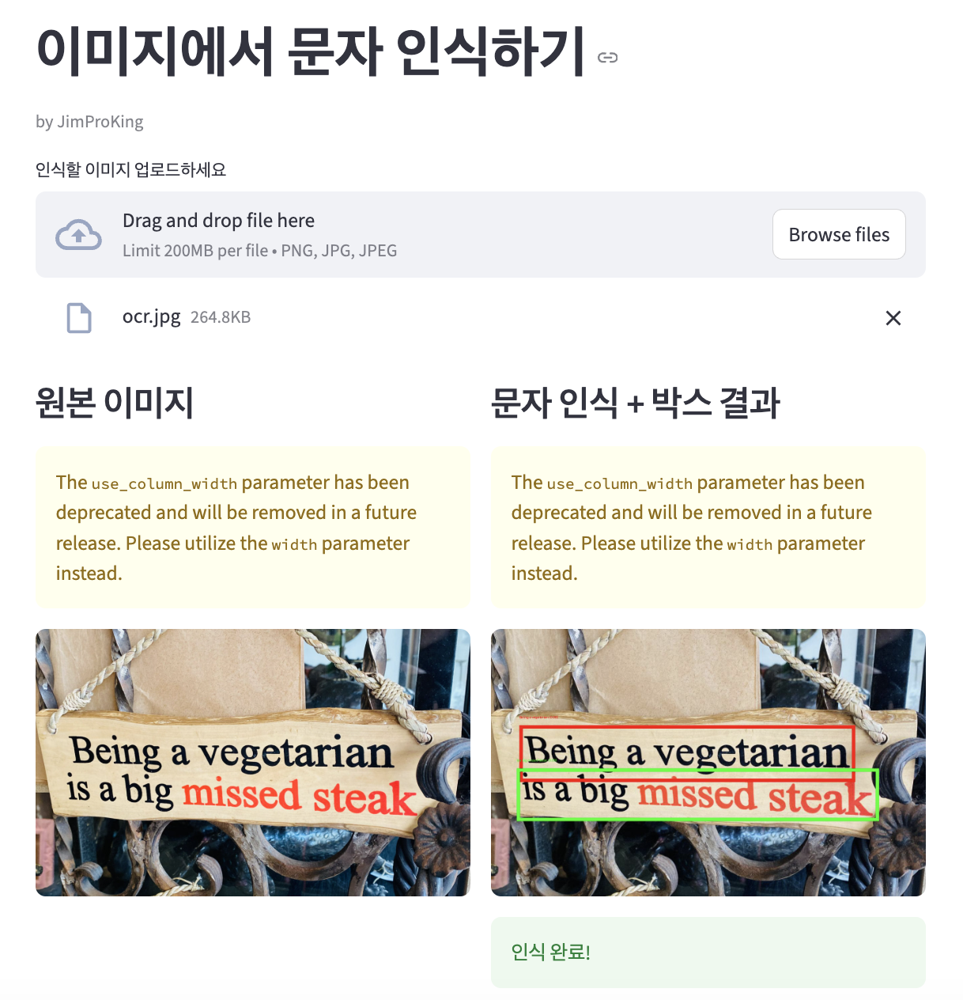
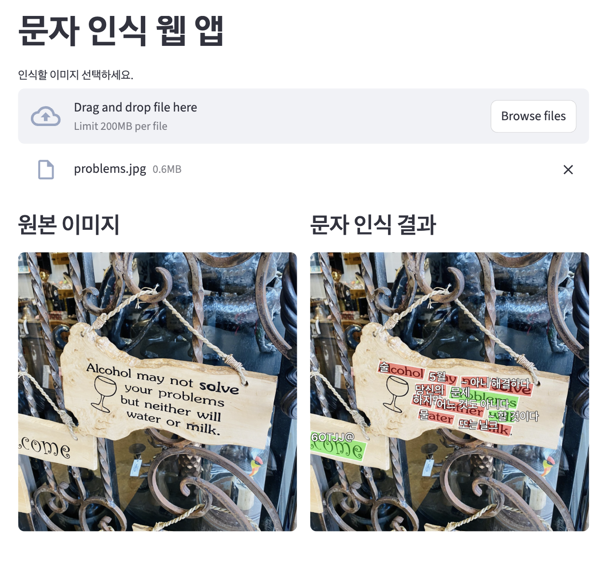

# OCR_Pra
OCR 연습하며 익히는 레포지토리

## 코드 예제

```python
from pathlib import Path
import easyocr

IN_DIR = Path("images")  # 이미지 폴더 경로

def read_text(path: Path) -> list:
    """이미지에서 텍스트를 추출합니다."""
    reader = easyocr.Reader(["ko", "en"], verbose=False)  # 한국어 + 영어 지원
    return reader.readtext(path.read_bytes())

if __name__ == "__main__":
    path = IN_DIR / "ocr.jpg"
    result = read_text(path)
    print(result)
```


실행 결과
text[([[85, 288], [1088, 288], [1088, 457], [85, 457]], 
  'Being a vegetarian', 
  0.97995740072074),
 ([[77, 417], [1159, 417], [1159, 574], [77, 574]], 
  'is a big missed18 steak', 
  0.5018739575437652)]

# 결과해석

항목설명[[x1,y1], ...]텍스트가 위치한 박스 좌표 (좌상 → 우상 → 우하 → 좌하)'텍스트'실제 인식된 문장0.97...정확도 (1에 가까울수록 잘 읽음)

# step_2_4.py
단순하게 문자 인식만 해주는 웹앱 - streamlit 사용


# step_3_4.py
영어면 한글로 번역까지 해주는 웹앱

* deepl 썼으면 더 정확했을 것 같은데, 구글번역기 썼더니 구 단위로 번역..
  -> 서비스용 아니니까 크게 의미두지 말기
